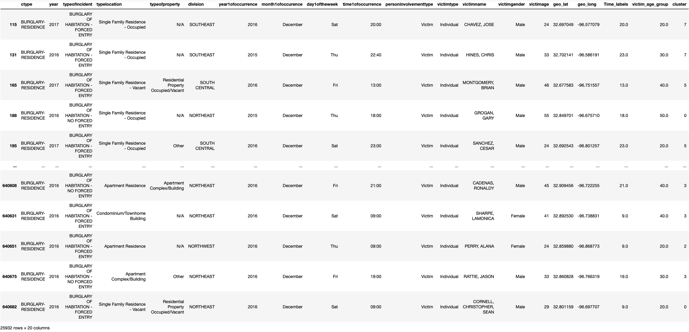
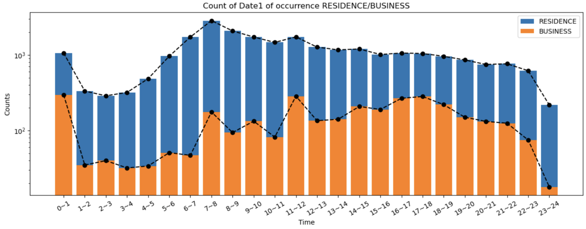
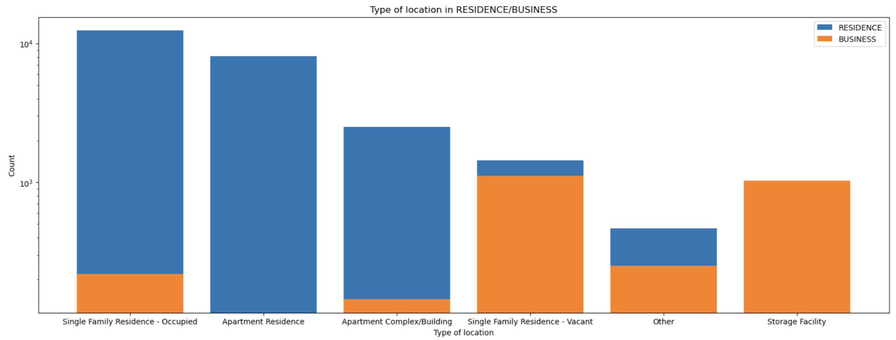
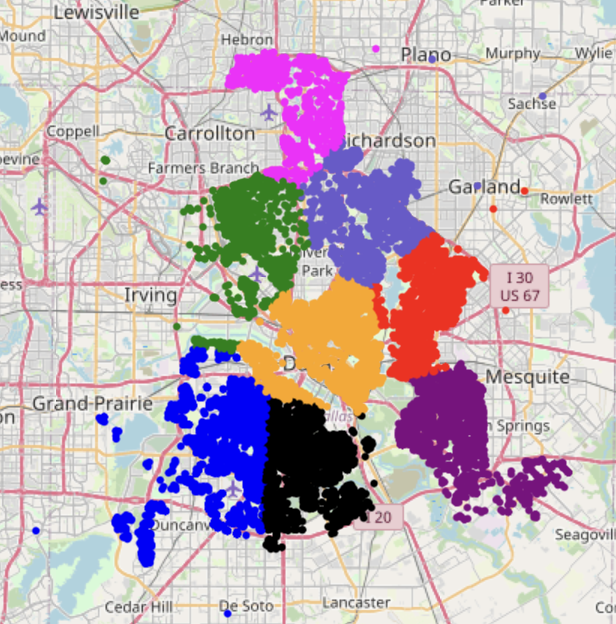
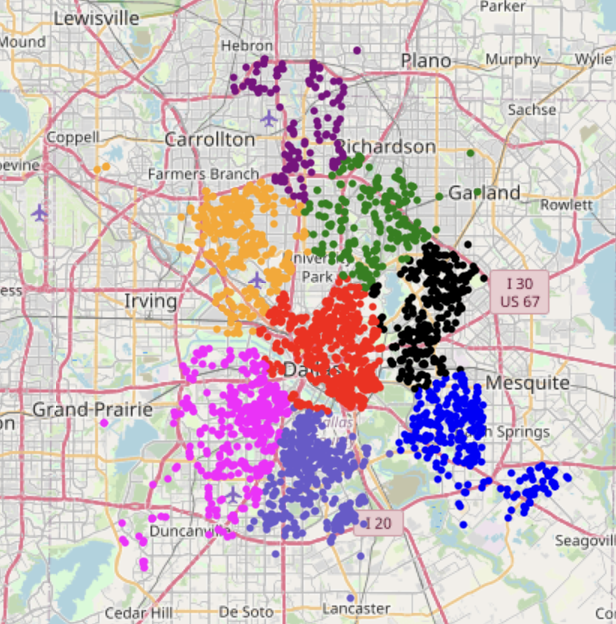

# Exploratory Data Analysis 
### - StudentID: 22000624
### - Name: Seungmin Jang
### - 1st Major: Life_science
### - 2nd Major: Ai_convergence
 

<i>We analyze the two aspects of BURGLARY, RESIDENCE and BUSINESS data, which appeared highly in Dallas' report data, in time and space. RESIDENCE, which is frequently revealed during weekdays, morning and afternoon hours, and BUSINESS, which is frequently revealed during weekends and evenings and nights, show different appearances in time, so the number of two cases can be separated. In addition, type locations are analyzed and RESIDENCE and BUSINESS are analyzed by dividing them into what places are common. Finally, guidelines are presented to police and security companies based on these values. During the day on weekdays, the focus should be on RESIDENCE, and on weekend evenings and nights, the focus should be on BUSINESS. In addition, it shows that looking at Single Family Residence-Occupied and Apartment Residence when the RESIDENCE region is focused, and Single Family Residence-Vacant and Storage Facility first when the BUSINESS region is focused can have a positive effect. It suggests that if you belong to each pattern to prepare for this in advance, you should pay more attention. </i>

  
## 1. Data overview  
1. BURGLARY_RESIDENCE
    - Sample size : 25932
    - Number of variables : 19
    - Data type :
      |Variables|Non-null count|Dtype|
      |------|---|---|
      |ctype|25932|object|
      |year|25932|int16|
      |typeofincident|25932|object|
      |typelocation|25932|object|
      |typeofproperty|25932|object|
      |division|25932|object|
      |year1ofoccurrence|25932|object|
      |month1ofoccurrence|25932|object|
      |day1oftheweek|25932|object|
      |time1ofoccurrence|25932|object|
      |personinvolvementtype|25932|object|
      |victimtype|25932|object|
      |victimgender|25932|object|
      |victimage|25932|int64|
      |geo_lat|25932|float64|
      |geo_long|25932|float64|
      |Time_labels|25932|float64|
      |victim_age_group|25932|float64|
      |cluster|25932|int32|
  <figure>
    
    <figcaption>
Table 1. BURGLARY_RESIDENCE DataFrame
</figcaption>
  </figure>

2. BURGLARY_BUSINESS
    - Sample size : 3248
    - Number of variables : 19
    - Data type :
      |Variables|Non-null count|Dtype|
      |------|---|---|
      |ctype|3248|object|
      |year|3248|int16|
      |typeofincident|3248|object|
      |typelocation|3248|object|
      |typeofproperty|3248|object|
      |division|3248|object|
      |year1ofoccurrence|3248|object|
      |month1ofoccurrence|3248|object|
      |day1oftheweek|3248|object|
      |time1ofoccurrence|3248|object|
      |personinvolvementtype|3248|object|
      |victimtype|3248|object|
      |victimgender|3248|object|
      |victimage|3248|int64|
      |geo_lat|3248|float64|
      |geo_long|3248|float64|
      |Time_labels|3248|float64|
      |victim_age_group|3248|float64|
      |cluster|3248|int32|
  <figure>
    
    <figcaption>
Table 2. BURGLARY_BUSINESS DataFrame
</figcaption>
  </figure>

Descriptives statistics on overall data (sample size, number of variables, data type, data range, distribution, etc.)    

  
## 2. Univariate analysis  
It presents descriptions and graphs of important variables used to analyze patterns and results. 

### 2.1 date1occurrence  

<figure>
  
  <figcaption>
Figure 1. Time1_occurrence in Residence/Business data
</figcaption>
</figure>

It is a value that accumulated by accumulating variables and business, the time interval of the business. This was conducted to investigate the time zone where BURGLARY appears most frequently. The purple color of orange color is a business.Compared to the business, the value of Resistance data, it was not seen as much as well as the business.

Figure 1 may be confirmed that the Resistance and business has different dances. This can be considered by separating time and afternoon.Respiratory Syndrome can be seen that most people are mainly in the morning and afternoon, and the afternoon, and it can be confirmed that the more than individual reasons.However, business can check that people are quite small forms in the morning and afternoon, and evening, and the evening of work and evening.

This is possible to analyze time patterns against each other.

### 2.2 day1oftheweek  

<figure>
  
  <figcaption>
Figure 2. Day1_of_the_week in Residence/Business data
</figcaption>
</figure>

Before starting the pattern analysis, the analysis was also conducted by reducing the number to log_scale to compare RESIDENCE and BUSINESS.

The reason for analyzing Day1_of_the_week is to analyze the day when BURGLARY appears the most. RESIDENCE and BUSINESS represent values with their respective unique patterns, as mentioned earlier. First of all, the same thing is that the most BURGLARY appears on 'Friday'. However, if you check the pattern after that, you can see each unique element. RESIDENCE appears more on weekdays than on weekends. Given the reason, people visit the company on weekdays, which is likely to leave their residences empty. However, it is interpreted that there will be a limit to entering other people's property because people often rest or do activities at their own homes on weekends. Therefore, it can be seen that the graph of Saturday and Sunday falls sharply in RESIDENCE. But BUSINESS represents a different phenomenon. Unlike RESIDENCE, BUSINESS does not show a large frequency on weekdays. However, it has risen sharply since Friday, and does not show a tendency to decrease sharply over the weekend.

As mentioned earlier, it is possible to see how different the temporal patterns of RESIDENCE and BUSINESS are when the values are analyzed by classifying them based on 'day of the week'.

### 2.3 typelocation  

<figure>
  
  <figcaption>
Figure 3. Type location in Residence/Business data
</figcaption>
</figure>

Finally, the typelocation variable was visualized to determine in which space the most BURGLARY appears. As you can see from the graph, the place where RESIDENCE's BURGLARY appears the most was 'Single Family Residence – Occupied', which accounts for most of the values. It then occupies high prices in the order of individual private land such as apartments and buildings. However, BUSINESS was highly characterized in empty houses and storage facilities that were not registered in someone's name and kept personal or corporate goods.

In each case, RESIDENCE showed the highest value in individual homes, and in BUSINESS, it can be seen that the most BURGLARY was found in empty houses and storage facilities.

  
## 3. Multivariate analysis  
Presenation of hidden patterns between variables (correlation, clustering, etc.)

### 3.1 Clustering  
Clustering was performed to identify patterns between different variables. The variables used during clustering are (geo_lat, geo_long) and type_location. The reason for this use is to set the clustering direction as spatial data understanding and to determine what characteristics the divided space has for each location.

First, clustering was performed with values of geo_lat and geo_long. Since it was to see how the location of the event was related to each cluster, it was visualized using folium. The visualized picture is as follows.
 

<figure>
  
  <figcaption>
Figure 4. Clustering in RESIDENCE
</figcaption>
</figure>

Figure 4 is the value obtained by clustering the space where BURGLARY-RESIDENCE occurred. The number of clusters was designated as eight and clustered, and it can be seen that they were grouped by region.
 

<figure>
  
  <figcaption>
Figure 5. Clustering in BUSINESS
</figcaption>
</figure>

Figure 5 is the value obtained by clustering the space where BURGLARY-BUSINESS occurred. The number of clusters was designated as eight and clustered, and it can be seen that they were grouped by region in the same way as above.
 

<figure>
  
  <figcaption>
Figure 6. Type of incident in RESIDENCE
</figcaption>
</figure>

I drew a plot to find out the relationship between the BURGLARY-RESIDENCE and the typelocation variable. Among them, the sections that caught my eye were c3 and c6. Apart from other sections, this section shows that more BURGLARY has occurred in Apartment Residence than Singlel Family Residence – Occupied. When I checked this through the MAP visualized above, it was confirmed that it was a connected area. In all other clustering regions, it can be seen that the Single Family Residence-Occupied value was the highest.

When looking at the type_location variable associated with the area where BURGLARY occurred, it can be seen that c3 and c6 should pay more attention to apartment resistance.

  
## 4. Suggestion  
Through the above analysis, we will present a method for solving BURGLARY.

First, it is necessary to analyze what characteristics BURGLARY has. Based on the results analyzed earlier, BURGLARY is divided into RESIDENCE and BUSINESS and stores different characteristics. RISIDENCE appears frequently on weekdays, mornings, and afternoons. It can be seen that BURGLARY appears mainly for residential areas such as Single Family Residence-Occupied and Apartment Reside. However, BUSINESS appears frequently on weekends, evenings, and nights. It can be seen that it mainly appears in places such as Single Family Residence – Vacant, and Storage Facility.

Secondly, we need to come up with a solution based on the results of the investigation. I think proper police cooperation is needed to solve the above problems in the Dallas area. The pattern is separated so that private areas can be bounded in the morning and afternoon hours of weekdays and workplaces can be bounded in the evening and night hours of weekends. Also, based on the high results on Friday as a whole, I think we will be able to strengthen surveillance to protect citizens' properties and business sites.

I think this will solve the characteristics of frequently occurring problems, and I think that if additional data (CCTV, Police, etc.) are used for a better solution, a better solution can be achieved.

In Dallas, it is suggested that since individuals have time and space limitations, it is important for individuals to identify and prepare for data patterns for BURGLARY in order to overcome them.